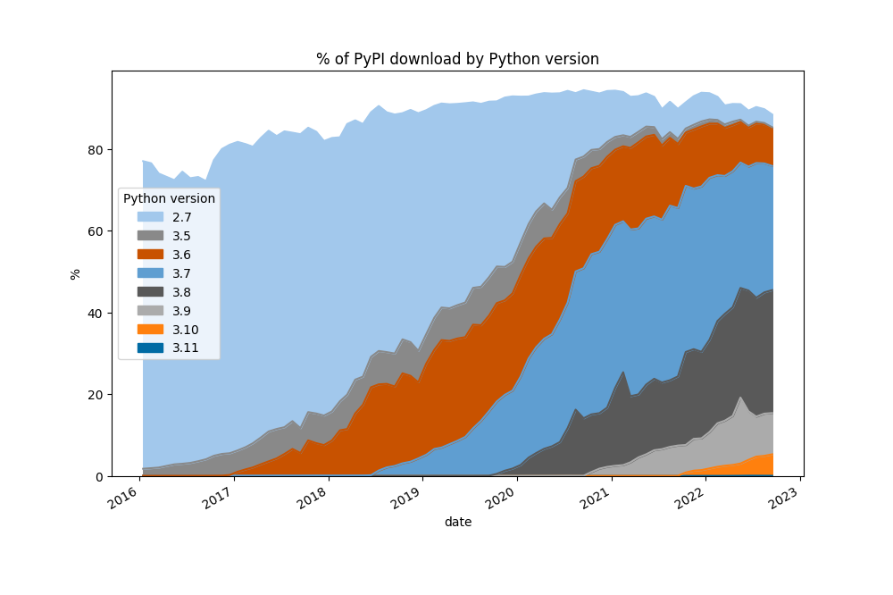

# Analysis of version adoptions on PyPI

We get
[publicly available PyPI download statistics](https://bigquery.cloud.google.com/table/bigquery-public-data:pypi.downloads)
on Google BigQuery using [pypinfo](https://github.com/ofek/pypinfo/).

[Here](https://github.com/pypa/linehaul-cloud-function) is the repo
for the open-source code pushing the pypi stats to BigQuery.

## Usage

First you need to get an access to PyPI's BigQuery, by following
[pypinfo](https://github.com/ofek/pypinfo/) procedure.

Then there's two main invocations, first fetch the data using:

    python python-versions.py --fetch

Then plot it using:

    python python-versions.py

## Data

### Number of pypi.org downloads

### Percentage of pypi.org downloads

