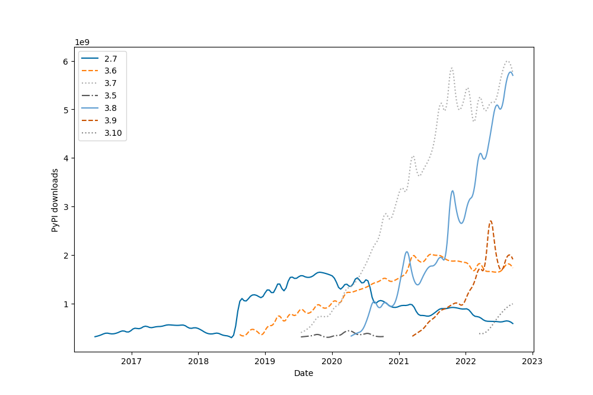

# Analysis of version adoptions on Pypi

We get PyPI download statistics via Google's BigQuery using the
[pypinfo](https://github.com/ofek/pypinfo/) tool.

## Usage

First you need to get an access to PyPI's BigQuery, by following
[pypinfo](https://github.com/ofek/pypinfo/) procedure.

Then there's two main invocations, first fetch the data using:

    python python-versions.py --fetch

Then plot it using:

    python python-versions.py

## Data

